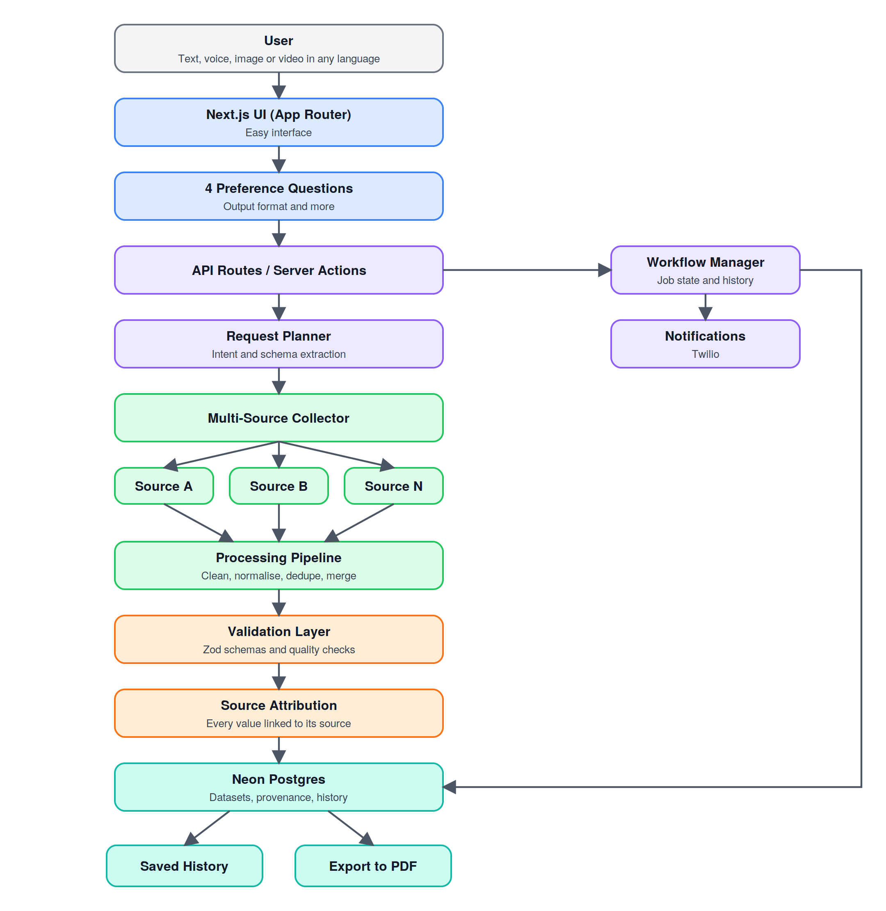

<div align="center">


# FetchIT - **Making data easier to get.**

**AI-powered data intelligence platform**. 

Ask for data in any language — through text, voice, images, or video. FetchIT collects, cleans, validates, and delivers a source-backed dataset ready to use.


</div>

---

## Table of Contents

1. [The Problem](#the-problem)
2. [The Solution](#the-solution)
3. [Key Features](#key-features)
4. [Tech Stack](#tech-stack)
5. [System Architecture](#system-architecture)
6. [Folder Structure](#folder-structure)
7. [Getting Started](#getting-started)
8. [Git Workflow](#git-workflow)
9. [Deployment](#deployment)
10. [License](#license)

---

## Overview

Finding reliable data is often harder than analysing it.

Data is scattered across websites, APIs, documents, and portals. Collecting it usually means searching manually, writing scrapers, copying information into spreadsheets, cleaning inconsistent values, removing duplicates, and trying to remember where each value came from.

**FetchIT turns that entire process into a workflow.**

Give FetchIT a request such as:

> *"Give me the top 50 EV models sold in India with price, range, and battery capacity."*

FetchIT understands the request, asks a few preferences to shape the output, collects information from multiple sources, processes and validates the records, preserves their provenance, and delivers the resulting dataset in a usable format.

### The idea

**Ask → Plan → Collect → Process → Validate → Attribute → Deliver**

---

## Why FetchIT?

Traditional data collection often requires a combination of:

* Manual web research
* Multiple APIs and websites
* Custom scraping scripts
* Spreadsheet-based cleaning
* Manual deduplication
* Repeated validation
* Separate source tracking

FetchIT brings these steps together into one interface.

| Traditional workflow             | FetchIT                           |
| -------------------------------- | --------------------------------- |
| Search multiple sources manually | Multi-source collection           |
| Write queries or scrapers        | Natural-language requests         |
| Clean spreadsheets manually      | Automated processing              |
| Resolve duplicates yourself      | Automated deduplication           |
| Check records manually           | Schema and quality validation     |
| Lose track of sources            | Field-level source attribution    |
| Rebuild one-off workflows        | Trackable, reusable runs          |
| Export manually                  | Ready-to-use dataset + PDF export |

---

## The Problem

Getting a trustworthy dataset is still mostly manual work.

### 1. Data is scattered

The data you need lives across websites, APIs, documents, and portals, each with its own format.

### 2. Collection is time-consuming

Analysts and developers often spend significant time searching, scraping, copying, and combining information before analysis can even begin.

### 3. Raw data is messy

Different sources may use different formats, units, naming conventions, and structures. Missing values and duplicate records make the final dataset harder to use.

### 4. Provenance gets lost

After information from multiple sources is combined, it can become difficult to determine where an individual value came from.

### 5. Workflows are difficult to repeat

One-off scripts and spreadsheets can become fragile when source structures change or when the same task needs to be performed again.

---

## The Solution

**FetchIT is an AI-powered data intelligence platform that converts natural requests into structured, source-backed datasets.**

Users can submit requests through:

* 💬 Text
* 🎙️ Voice
* 🖼️ Images
* 🎥 Video

Requests can also be made in **different languages or mixed-language input**.

FetchIT then:

1. **Understands** the request and extracts the intended data requirements.
2. **Personalises** the task through four quick preference questions.
3. **Plans** the required fields, schema, and collection workflow.
4. **Collects** information from multiple sources.
5. **Processes** raw records by cleaning, normalising, deduplicating, and merging them.
6. **Validates** records against schemas and quality checks.
7. **Preserves provenance** so values remain traceable to their sources.
8. **Tracks the workflow** from request to completion.
9. **Stores the result** for future access and reuse.
10. **Delivers** the final dataset in the requested format, including PDF export.

---

## Key Features

### 🌐 Multimodal Input

Submit a request through **text, voice, image, or video** instead of relying only on typed queries.

### 🗣️ Multilingual Requests

Ask for data in different languages or mix languages within the same request.

### ⚙️ AI-Powered Data Workflow

FetchIT transforms an unstructured request into a structured collection and processing workflow.

### ❓ Preference-Based Output

Before collection begins, FetchIT asks four short questions to understand how the user wants the final dataset structured and delivered.

### 🔎 Multi-Source Collection

Information can be collected from multiple sources and combined into a unified dataset.

### 🧹 Automated Data Processing

The processing pipeline handles:

* Cleaning
* Normalisation
* Deduplication
* Merging
* Missing-value handling

### ✅ Schema Validation

Records are checked against typed schemas using **Zod** and additional quality checks before being accepted.

### 🔗 Source Attribution

Dataset records retain information about their source, making the resulting data easier to inspect and audit.

### 🔄 Workflow Management

Each request is handled as a trackable workflow with states such as:

`Queued → Running → Validating → Completed`

### 🔔 Notifications

Users can receive notifications when a dataset is ready or when a workflow requires attention.

### 🔐 Authentication

User accounts keep datasets and request history separated through Neon Auth.

### 🗂️ Saved History

Previous requests and generated datasets remain available so users can revisit and reuse them.

### 📄 PDF Export

Finished datasets can be exported to PDF directly from the interface.

### 📱 Responsive Interface

A clean interface built with Tailwind CSS and shadcn/ui keeps the workflow simple for both technical and non-technical users.

---

## Tech Stack

| Layer               | Technology                                                         |
| ------------------- | ------------------------------------------------------------------ |
| **Framework**       | [Next.js 16](https://nextjs.org) — App Router                      |
| **Frontend**        | [React 19](https://react.dev)                                      |
| **Language**        | [TypeScript](https://www.typescriptlang.org)                       |
| **Styling**         | [Tailwind CSS 4](https://tailwindcss.com)                          |
| **UI Components**   | [shadcn/ui](https://ui.shadcn.com), [Base UI](https://base-ui.com) |
| **Icons**           | [Lucide](https://lucide.dev)                                       |
| **Database**        | [Neon](https://neon.tech) Serverless Postgres                      |
| **Authentication**  | Neon Auth                                                          |
| **Validation**      | [Zod](https://zod.dev)                                             |
| **Notifications**   | [Twilio](https://www.twilio.com)                                   |
| **Analytics**       | Vercel Analytics                                                   |
| **Package Manager** | [pnpm](https://pnpm.io)                                            |
| **Development**     | [v0](https://v0.app)                                               |
| **Deployment**      | [Vercel](https://vercel.com)                                       |

## System Architecture
 
<p align="center">
  
</p>
 
</details>
 
**How a request flows**
 
1. **Request:** the user submits a request from the UI as text, voice, image, or video, in any language.
2. **Preferences and planning:** FetchIT asks 4 short preference questions (including the preferred output format), then converts the request into a structured plan: target fields, schema, and sources to query.
3. **Collection:** the collector fetches from each source and returns raw records with source metadata.
4. **Processing:** raw records are cleaned, normalised, de-duplicated, and merged.
5. **Validation:** merged records are checked against the schema; invalid rows are flagged or rejected.
6. **Attribution and storage:** accepted records are stored in Neon along with their provenance.
7. **Workflow tracking and history:** every step updates job state and is saved to history, and notifications fire on completion or failure. Finished datasets can be exported to PDF.
<!-- VERIFY: adjust the stages, sources, and LLM/search provider above to match lib/ and app/api/ in your code. -->

## Folder Structure

```text
FetchIT/
├── .agents/skills/        # AI agent skills
├── app/                   # Next.js App Router
│   ├── api/               # API routes
│   ├── ...                # Pages and layouts
├── components/            # Reusable UI components
├── docs/                  # Documentation assets (architecture diagram)
├── lib/                   # Core application logic
│   ├── collection/        # Data collection
│   ├── processing/        # Cleaning and transformation
│   ├── validation/        # Schema and quality validation
│   └── ...                # Database and utilities
├── migrations/            # Database migrations
├── public/                # Static assets
├── scripts/               # Utility scripts
├── AGENTS.md              # AI coding-agent instructions
├── components.json        # shadcn/ui configuration
├── neon.ts                # Neon configuration
├── next.config.mjs        # Next.js configuration
├── package.json
├── pnpm-lock.yaml
├── pnpm-workspace.yaml
├── tsconfig.json
└── README.md

```

## Getting Started

### Prerequisites

* **Node.js 20.9+**
* **pnpm**
* **Git**
* A **Neon** account
* A **Twilio** account if notifications are enabled

### Install pnpm

```bash
npm install -g pnpm
```

---

## 1. Clone the Repository

```bash
git clone https://github.com/ishita2740/FetchIT.git
cd FetchIT
```

---

## 2. Install Dependencies

```bash
pnpm install
```

---

## 3. Configure Environment Variables

Create a `.env.local` file in the project root.

```env
DATABASE_URL="postgresql://<user>:<password>@<host>/<db>?sslmode=require"

NEON_AUTH_BASE_URL="https://<your-neon-auth-url>"

TWILIO_ACCOUNT_SID="your_account_sid"
TWILIO_AUTH_TOKEN="your_auth_token"
TWILIO_PHONE_NUMBER="+10000000000"

# Add any additional AI/data provider keys required by your implementation.
```

> **Never commit `.env.local` or expose API keys publicly.**

---

## 4. Set Up the Database

Create a project in Neon and add the connection string to `DATABASE_URL`.

Then apply the migrations:

```bash
psql "$DATABASE_URL" -f migrations/<file>.sql
```

Run the migration files in their intended order.

---

## 5. Start the Development Server

```bash
pnpm dev
```

Open:

```text
http://localhost:3000
```

---

# Available Scripts

| Command      | Purpose                              |
| ------------ | ------------------------------------ |
| `pnpm dev`   | Start the development server         |
| `pnpm build` | Build the application for production |
| `pnpm start` | Start the production server          |

---

## Try FetchIT

After starting the application:

1. Sign up or log in.

2. Submit a request such as:

   > *"List the top 20 public universities in Maharashtra with their NIRF rank and city."*

3. Answer the four preference questions.

4. Let FetchIT run the collection workflow.

5. Review the generated dataset.

6. Inspect source information.

7. Export the completed dataset as a PDF.

---

## Deployment

FetchIT is designed for deployment with **Vercel** and **Neon**.

### Deploy with Vercel

1. Push the repository to GitHub.
2. Import the repository into Vercel.
3. Configure the required environment variables.
4. Deploy the application.

Once configured, changes merged into `main` can trigger automatic deployments.

## License

No license has been added yet. Add a `LICENSE` file (for example MIT) to make the terms explicit.

---

<div align="center">

Built by [Ishita](https://github.com/ishita2740)

</div>
